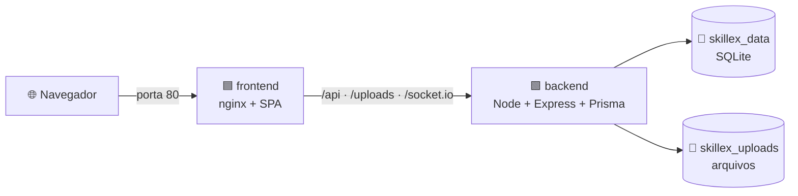

# 🐳 Guia Docker — SkillEx

Este guia explica como subir a plataforma **SkillEx** usando **Docker** e **Docker Compose**.
Não exige Node.js instalado no host — tudo roda em containers.

## Pré-requisitos

- **Docker Engine 20.10+** ou **Docker Desktop** ([download](https://www.docker.com/products/docker-desktop/))
- **Docker Compose v2** (já incluso no Docker Desktop)

> 💡 **No Windows / macOS:** o Docker Desktop precisa estar **aberto** antes
> dos comandos abaixo. Se aparecer
> `unable to get image ...: failed to connect to the docker API` ou
> `Cannot connect to the Docker daemon`, abra o Docker Desktop e aguarde
> o ícone na bandeja ficar verde.

Verifique a instalação:

```bash
docker --version
docker compose version
```

---

## Arquitetura dos containers



| Serviço | Imagem base | Porta exposta | Volumes |
|---------|-------------|---------------|---------|
| `backend` | `node:20-slim` | `3333` | `skillex_data`, `skillex_uploads` |
| `frontend` | `nginx:1.27-alpine` | `80` | — |

O frontend nginx faz **proxy reverso** para o backend, então o navegador conversa apenas com a porta 80. Banco SQLite e uploads ficam em **volumes nomeados**, sobrevivendo a `docker compose down`.

---

## 1. Subida rápida (recomendado)

Use o script `deploy.sh` na raiz do repositório:

```bash
./scripts/deploy.sh up
```

O script cuida de tudo:
- copia `.env.example` para `.env` se ainda não existir (e gera um `JWT_SECRET` aleatório);
- faz `docker compose build` + `up -d`;
- aguarda o backend ficar **healthy**;
- imprime as URLs de acesso.

Acesse depois:
- **Aplicação:** http://localhost
- **API:** http://localhost:3333
- **Healthcheck:** http://localhost:3333/health

---

## 1.1 Deploy numa VPS Ubuntu virgem 🆕

Em uma VPS **Ubuntu 20.04/22.04/24.04** (ou Debian 11/12) recém-instalada, sem Docker, sem nada — três comandos:

```bash
# 1. Instala o git (única dependência pra clonar)
sudo apt-get update && sudo apt-get install -y git

# 2. Clona o repositório
git clone <URL-do-repo> /opt/skillex && cd /opt/skillex

# 3. Provisiona o servidor e sobe a aplicação
sudo ./scripts/deploy.sh provision
```

O subcomando **`provision`** faz, na ordem:

1. **`bootstrap`** — `apt-get update`, instala `ca-certificates`, `curl`, `gnupg`, `git`, `openssl`, `ufw`; adiciona o repositório **oficial do Docker**, instala `docker-ce` + `docker compose plugin`; habilita o serviço; adiciona o usuário ao grupo `docker`; libera portas **22/80/443** no UFW e ativa o firewall.
2. **`up`** — cria `.env` com `JWT_SECRET` aleatório, builda e sobe os containers, aguarda `healthy`.

> ⚠️ **Depois do `provision`** faça **logout/login** uma única vez para que seu usuário herde o grupo `docker` (a partir daí o `deploy.sh up` roda sem `sudo`).

Se preferir separar as etapas:

```bash
sudo ./scripts/deploy.sh bootstrap   # só provisiona o SO
# (logout/login)
./scripts/deploy.sh up               # sobe a aplicação
```

### O que o bootstrap NÃO faz

Por design o bootstrap é mínimo. Se você precisa, configure separadamente:

| Item | Como fazer |
|------|-----------|
| Domínio + HTTPS | Adicione Caddy/Traefik na frente, ou `certbot --nginx` numa instância de nginx no host |
| Backups automáticos | `cron` chamando `docker compose exec backend sh -c 'cat /app/data/skillex.db' > /backups/...` |
| Atualizações automáticas | `unattended-upgrades` (`sudo apt install unattended-upgrades`) |
| Monitoramento | Prometheus/Grafana, ou um serviço gerenciado |
| Swap (VPS com pouca RAM) | `fallocate -l 2G /swapfile && mkswap /swapfile && swapon /swapfile` |

---

## 2. Subida manual (passo a passo)

```bash
# 1. Copie o template de variáveis de ambiente
cp .env.example .env

# 2. (Opcional) Edite .env e defina um JWT_SECRET forte
#    Em produção isto é obrigatório!

# 3. Build das imagens
docker compose build

# 4. Sobe em segundo plano
docker compose up -d

# 5. Acompanhe os logs
docker compose logs -f
```

---

## 3. Variáveis de ambiente

As variáveis ficam em `.env` na raiz (criado a partir de `.env.example`).

| Variável | Padrão | Descrição |
|----------|--------|-----------|
| `JWT_SECRET` | `skillex-docker-secret-CHANGE-ME` | **Mude obrigatoriamente em produção** |
| `JWT_EXPIRES_IN` | `7d` | Tempo de vida do token |
| `MAX_UPLOAD_SIZE_MB` | `5` | Limite de upload em MB |
| `JITSI_DOMAIN` | `jitsi.localhost:8000` | Domínio externo da instância Jitsi (browser) |
| `JITSI_APP_ID` | `skillex` | Identidade JWT (mesmo valor lido pelo backend e pelo prosody) |
| `JITSI_APP_SECRET` | — | Segredo para assinar JWT do Jitsi (obrigatório p/ vídeo) |

Para gerar um `JWT_SECRET` forte:

```bash
openssl rand -hex 32
```

---

## 4. Comandos do dia a dia

| Ação | Comando |
|------|---------|
| Subir a stack | `./scripts/deploy.sh up` |
| Derrubar (mantém dados) | `./scripts/deploy.sh down` |
| Reconstruir do zero | `./scripts/deploy.sh rebuild` |
| Ver logs | `./scripts/deploy.sh logs` |
| Ver status | `./scripts/deploy.sh status` |
| Apagar tudo (inclusive volumes) | `./scripts/deploy.sh clean` |

Equivalentes em `docker compose` direto:

```bash
docker compose up -d                  # subir
docker compose down                   # parar (mantém volumes)
docker compose down -v                # parar e APAGAR volumes
docker compose logs -f backend        # logs de um serviço
docker compose ps                     # status
docker compose exec backend sh        # shell dentro do backend
```

---

## 5. Persistência de dados

Dois volumes nomeados persistem o estado:

| Volume | Conteúdo | Caminho no container |
|--------|----------|----------------------|
| `tcc_skillex_data` | Banco SQLite (`skillex.db`) | `/app/data` |
| `tcc_skillex_uploads` | Fotos de perfil e anexos | `/app/uploads` |

Para inspecionar:

```bash
docker volume ls --filter name=tcc_skillex
docker volume inspect tcc_skillex_data
```

Para fazer **backup** do banco:

```bash
docker compose exec backend sh -c 'cat /app/data/skillex.db' > skillex-backup.db
```

> ⚠️ `docker compose down -v` **apaga** os volumes e todos os dados.

---

## 6. Migrations e seed

As migrations do Prisma rodam automaticamente quando o backend inicia (`prisma migrate deploy`). Para **popular o banco** com dados de demonstração:

```bash
docker compose exec backend npx tsx prisma/seed.ts
```

Para **resetar** o banco do zero:

```bash
docker compose down -v && ./scripts/deploy.sh up
```

---

## 7. Solução de problemas

| Sintoma | Diagnóstico / Solução |
|---------|----------------------|
| `Cannot connect to the Docker daemon` | Docker Desktop não está rodando |
| Porta 80 ou 3333 ocupada | Pare o processo conflitante ou edite `docker-compose.yml` |
| Backend fica `unhealthy` | Veja `docker compose logs backend` — geralmente falha de migration |
| `db:up` mas a aplicação não carrega | Confira no navegador o console de rede — pode ser CORS ou `CLIENT_URL` |
| Build muito lento | A primeira vez baixa as imagens base (≈ 200 MB) |
| Mudou o `.env` mas nada mudou | `docker compose up -d` precisa de `--force-recreate` para reler env |

Para investigar um container vivo:

```bash
docker compose exec backend sh
# dentro do container:
ls /app/data
cat /app/prisma/schema.prisma
```

---

## 8. Healthcheck

O backend expõe `/health` e o compose verifica a cada 20s:

```yaml
healthcheck:
  test: ["CMD", "wget", "-qO-", "http://localhost:3333/health"]
  interval: 20s
  timeout: 5s
  retries: 5
  start_period: 30s
```

O frontend só inicia depois que o backend reporta `healthy` (`depends_on.condition: service_healthy`).

---

## 9. Vídeo chamada (Jitsi self-hosted)

A vídeo chamada das trocas roda numa stack Jitsi **100% auto-hospedada** — nada da Jitsi.org é chamado em runtime. Para ativá-la, sobe-se o compose adicional `compose.jitsi.yml` junto do principal.

> Todas as variáveis (app + Jitsi) ficam num **único `.env` na raiz** — é o arquivo que tanto o Docker Compose quanto o backend lêem. Não há `.env.jitsi` separado: o `JITSI_APP_SECRET` é lido da mesma variável pelo backend (assina o JWT) e pelo prosody (verifica o JWT), eliminando qualquer chance de divergência.

### 9.1 Setup inicial (uma vez)

1. **Adicione o hostname no `hosts` do sistema** (para o navegador resolver `jitsi.localhost`):
   - Linux/macOS: `/etc/hosts`
   - Windows: `C:\Windows\System32\drivers\etc\hosts`

   ```
   127.0.0.1 jitsi.localhost
   ```

2. **Gere os 4 segredos** (`JWT_SECRET`, `JITSI_APP_SECRET`, `JITSI_JICOFO_COMPONENT_SECRET`, `JITSI_JICOFO_AUTH_PASSWORD`, `JITSI_JVB_AUTH_PASSWORD`):

   ```bash
   openssl rand -hex 32
   ```

3. **Preencha `.env`** (cópia de `.env.example` se ainda não existir) substituindo cada `CHANGE-ME-*` pelos valores gerados.

### 9.2 Subir tudo

```bash
docker compose -f docker-compose.yml -f compose.jitsi.yml up --build
```

O Compose carrega o `.env` da raiz automaticamente — sem precisar de `--env-file`.

Aguarde os logs de `prosody`, `jicofo` e `jvb` reportarem prontidão.

| Serviço | Porta exposta | Função |
|---------|---------------|--------|
| `jitsi-web` | `8000` (HTTP) | UI + `external_api.js` |
| `prosody` | — (interno) | XMPP + auth JWT |
| `jicofo` | — (interno) | Focus de conferência |
| `jvb` | `10000/udp`, `4443` | Vídeo bridge (RTP) |

### 9.3 Verificação rápida

- Abra `http://jitsi.localhost:8000` — deve aparecer a tela do Jitsi (sem JWT, prosody bloqueia entrar em sala — é o comportamento esperado).
- Logue como `ana@skillex.com` e `bruno@skillex.com` (em dois browsers), crie e aceite uma troca, depois clique **Iniciar vídeo chamada** em `/requests/:id`.
- No DevTools (aba Network), confirme que **nenhum** request vai a `meet.jit.si`, `jitsi.org` ou `8x8.vc`. Tudo deve passar por `jitsi.localhost`.

### 9.4 Notas de produção

- **HTTPS é obrigatório** (browsers exigem secure context para câmera/mic em hostnames que não sejam `localhost`). Use Caddy ou nginx no host:
  - `app.<dominio>` → frontend
  - `jitsi.<dominio>` → `jitsi-web:80`
- **BOSH relativo**: deixamos `BOSH_RELATIVE: 1` no `compose.jitsi.yml`, o que faz o `config.js` do Jitsi gerar `config.bosh = '/http-bind'` (URL relativa). Sem isso, a imagem `jitsi/web:stable-9779` concatena `https://${PUBLIC_URL}` na URL do BOSH; em dev (PUBLIC_URL `http://...`), o resultado é o lixo `https://http://jitsi.localhost:8000/http-bind` e o cliente nunca conecta no XMPP — a sala fica eternamente em "Connecting…". A URL relativa funciona igualmente bem sob HTTPS de produção, então deixe `BOSH_RELATIVE: 1` sempre.
- **Em produção, reative o WebSocket** definindo `ENABLE_XMPP_WEBSOCKET: 1` em `compose.jitsi.yml`. Em dev local sobre HTTP, deixamos em `0` para usar BOSH (HTTP long-polling), porque o WS sofre do mesmo bug do BOSH descrito acima (vira `wss://http://...` inválido) e não há flag equivalente a `BOSH_RELATIVE` para o WebSocket. Com HTTPS real, a URL `wss://app.dominio/xmpp-websocket` fica correta e o WS dá menor latência.
- **Abrir UDP 10000** no firewall (Mídia RTP do JVB). Sem isso, fallback para TCP/4443 degrada qualidade.
- `JITSI_APP_SECRET` deve vir de secret manager — nunca commitado.
- `DOCKER_HOST_ADDRESS` precisa ser o **IP público** da máquina (ou IP da LAN se for uso interno).

### 9.5 Derrubar só o Jitsi

```bash
docker compose -f docker-compose.yml -f compose.jitsi.yml down
# ou, mantendo o sistema principal de pé:
docker compose -f compose.jitsi.yml down
```

---

## 10. Limpeza completa

Quando quiser **zerar tudo** (containers, imagens e dados):

```bash
./scripts/deploy.sh clean

# ou manualmente:
docker compose down -v --rmi local
```
